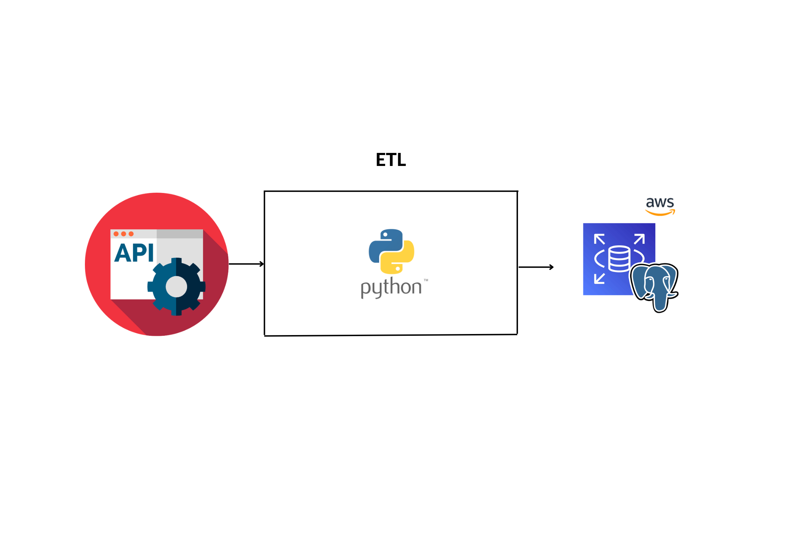
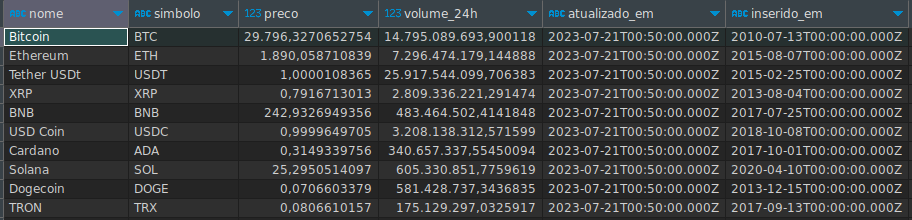

# Projeto de Engenharia de Dados com Python puro | Análise de Dados do Comércio internacional de Crypto Moedas

> 
## Intrudução

## Serviço em Nuvem 
> <a href="https://console.cloud.google.com/">Amazon Web Service (Relational Database Service)</a>

## Linguagem de programação 
> <a href="https://www.python.org/">Python</a> 
> <a href="https://pt.wikipedia.org/wiki/SQL">SQL</a>

## Bibliotecas e Frameworks
> <a "https://spark.apache.org/">Spark</a>
> <a "https://pandas.pydata.org/">Pandas</a>
> <a "https://www.sqlalchemy.org/">SqlAlchemy</a>

## Conjunto de Dados Utilizado via API 
Dados compartilhados por <a href="https://coinmarketcap.com/">CoinMarketcap.</a>

## Modelagem de Dados

## Arquitetura

## Entrega dos Dados no AWS RDS PostgreSQL

Mais informações <a href="https://www.linkedin.com/in/mario-barcelos/">Mario Barcelos</a>
# proj-eng-dados-cripto
# proj-eng-dados-cripto
# proj-eng-dados-cripto
# proj-eng-dados-cripto
