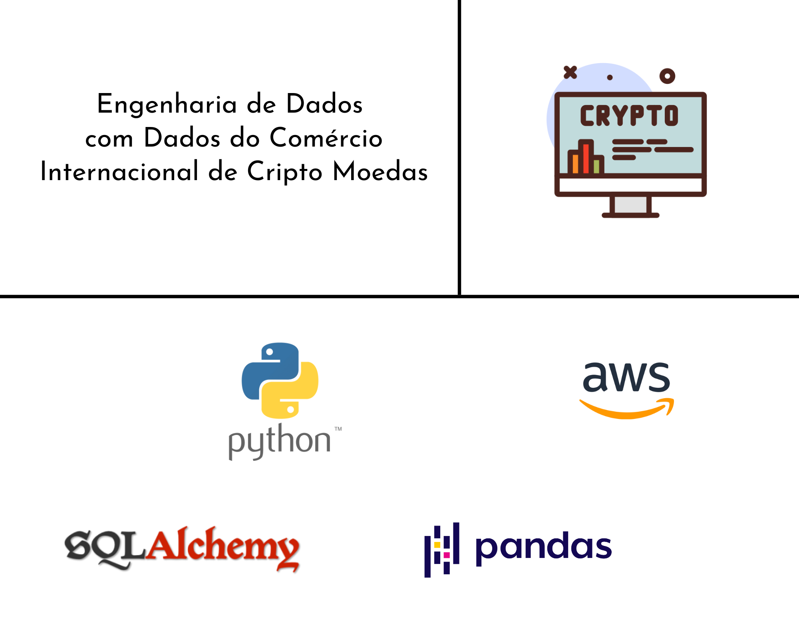

# Projeto de Engenharia de Dados em Batch | Comércio internacional de Cripto Moedas

>  Atividade Pythonica com objetivo simples de executar uma atividade em Batch.

## Intrudução
  A fim de praticar os bons hábitos de programar com Python, entrego neste pequeno projeto, Dados prontos para o uso comum em atividades de Ciência ou Análise de Dados. Inicio as atividades ingerindo dados não estruturados de uma API privada, seguindo regras de negócios pré-estabelecidas, encaminho os dados para modelagem, a fim de obter a melhor normalização, disponibilizo os dados manipulados e formatados em parquet, e em seguida, persisto todas as matérias primas no PostgreSql AWS RDS, alimentando regularmente serviços vinculados de Ciência de Dados ou Análise de Dados.
  

## Serviço em Nuvem 
> <a href="https://console.cloud.google.com/">Amazon Web Service (Relational Database Service)</a>

## Linguagem de programação 
> <a href="https://www.python.org/">Python</a> 
> <a href="https://pt.wikipedia.org/wiki/SQL">SQL</a>

## Bibliotecas e Frameworks
> <a href="https://pandas.pydata.org/">Pandas</a>
> <a href="https://www.sqlalchemy.org/">SqlAlchemy</a>

## Conjunto de Dados Utilizado via API 
Dados compartilhados por <a href="https://coinmarketcap.com/">CoinMarketcap.</a>

## Modelagem de Dados

## Arquitetura

## Entrega dos Dados no AWS RDS PostgreSQL

Mais informações <a href="https://www.linkedin.com/in/mario-barcelos/">Mario Barcelos</a>
